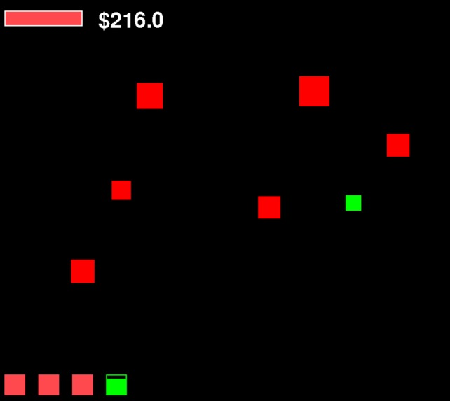

# Protect the Base
Protect the Base was a solo-project created in 24 hours for the 2024 Sunhacks Hackathon. The game is a fast paced, strategical top-down shooter. You must carefully manage ammo across 4 weapons -- the rifle, shotgun, sniper, and grenade launcher -- to defeat increasingly powerful waves of enemies who strafe, slide, and rush their way towards your base. Use the money you earned defeating enemies to buy unique upgrades, and become an invincible base!

### Technologies
Protect the Base is programmed entirely in Python, primarily using the PyGame package. In order to make as much content as possible, I focused on creating robust, extensible systems to make later development faster. This meant that although it took a while to program the first weapon and enemy, adding future variations would be incredible quick.

### What I Learned
As previosuly mentioned, I learned the importance of building inherited systems to code more efficiently. I also learned a valuable lesson in teammate selection. Though I had 3 partners lined up to help with development, several of them arrived having not slept the previuos night, and some were unwilling or unable to meaningfully contribute to the project. In the future, I will have to be more careful in selecting teammates that are both competent and serious about the project at hand.
